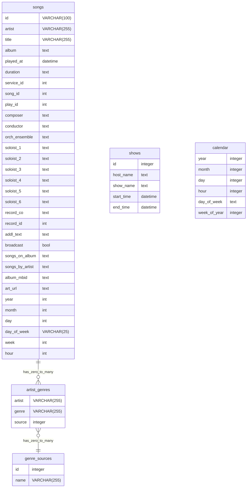

```mermaid
erDiagram
songs {
    id VARCHAR(100)
    artist VARCHAR(255)
    title VARCHAR(255)
    album text
    played_at datetime
    duration text
    service_id int 
    song_id int
    play_id int 
    composer text 
    conductor text 
    orch_ensemble text 
    soloist_1 text
    soloist_2 text 
    soloist_3 text 
    soloist_4 text
    soloist_5 text 
    soloist_6 text 
    record_co text 
    record_id int 
    addl_text text 
    broadcast bool 
    songs_on_album text
    songs_by_artist text 
    album_mbid text
    art_url text
    year int
    month int 
    day int
    day_of_week VARCHAR(25)
    week int
    hour int
}

shows{
    id integer
    host_name text
    show_name text
    start_time datetime
    end_time datetime
}

calendar {
    year integer
    month integer
    day integer
    hour integer
    day_of_week text
    week_of_year integer
}

artist_genres {
    artist VARCHAR(255)
    genre VARCHAR(255)
    source integer
}

genre_sources {
    id integer
    name VARCHAR(255)
}

songs ||--o{ artist_genres: has_zero_to_many
artist_genres }o--|| genre_sources: has_zero_to_many

```
